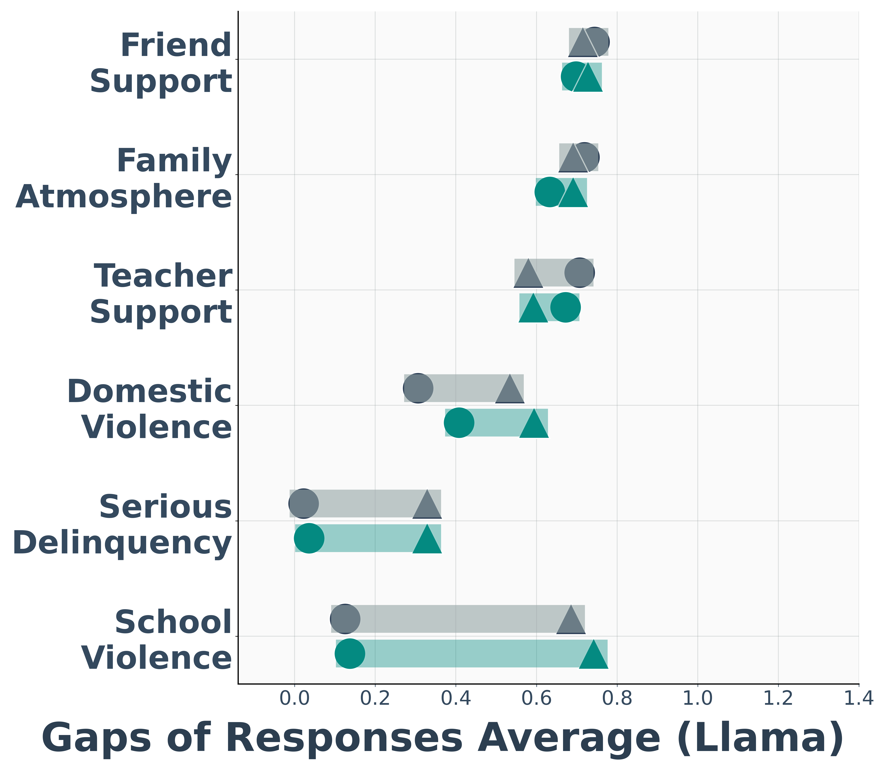
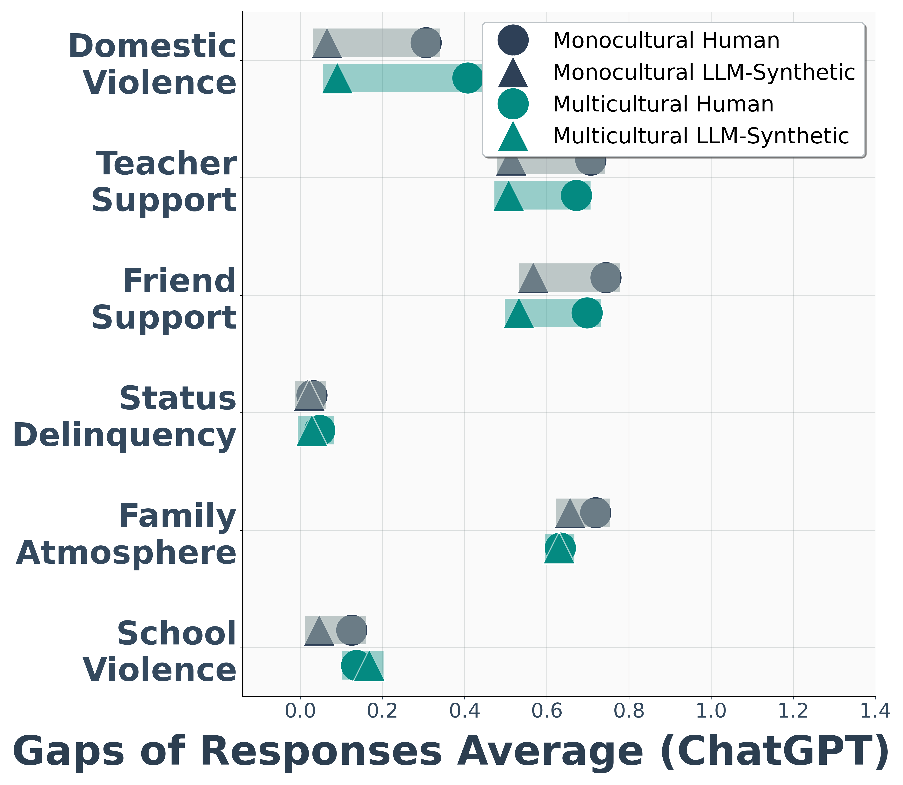

# Synthetic Data Fidelity Evaluation: Monocultural Adolescents vs. Multicultural Adolescents

This repository contains the analysis and visualization code used to evaluate how closely **LLM-generated synthetic survey responses** (produced separately by a monocultural and multicultural students) match the statistical properties of **real adolescent panel survey data**.

> **Note on scope:** The related study is currently under peer review. This repository releases only the *post-generation statistical validation and visualization code* shown in `visualization_gpt.ipynb` and `visualization_llama.ipynb`. The prompts used to generate the synthetic responses, and the broader raw-data preprocessing pipeline, are **not included** here and will be described in the paper upon publication.

## Repository Structure

| File | Description |
|---|---|
| `visualization_gpt.ipynb` | Compares real survey data against synthetic data generated by the GPT-based model |
| `visualization_llama.ipynb` | Compares real survey data against synthetic data generated by the Llama-based model |

Both notebooks follow an identical analysis pipeline, applied independently to each model's synthetic output, to allow direct comparison of synthetic-data fidelity between the two generators.

## Data

- **Real data**: an adolescent panel survey with two respondent subgroups — monocultural-background youth and multicultural-background youth — covering psychosocial constructs related to family environment, peer/teacher relationships, exposure to violence, delinquency, and depressive symptoms.
- **Synthetic data**: LLM-generated responses intended to emulate the same survey instrument, for each subgroup, produced separately by GPT and Llama (generation code/prompts are external to this repository).
- Raw data files (`.sav` survey files, synthetic response files) are **not included** in this repository. But it can be accessed at the [KOSSDA](http://www.kossda.or.kr).

## Methodology

### 1. Response Parsing
For the synthetic data, each model's raw generated text is parsed to extract the selected answer choice, which is then mapped onto the original survey's numeric response scale.

### 2. Missing-Value Handling
Invalid or non-response codes are recoded to missing (`NaN`) for both the real and synthetic datasets, following the coding scheme of the original survey instrument. Synthetic responses that could not be cleanly parsed into a valid answer choice are handled separately before aggregation.

### 3. Construct Aggregation
Item-level responses are aggregated into **11 composite constructs**, using either the mean (for attitudinal/relationship-style scales) or the sum (for count-type behavioral scales), depending on the construct:

- Family Atmosphere
- Father Intimacy
- Mother Intimacy
- Domestic Violence
- Child Abuse
- Teacher Support
- Friend Support
- School Violence
- Status Delinquency
- Serious Delinquency
- Depression

The same aggregation logic is applied consistently to both the real and synthetic datasets.

### 4. Normalization
Each composite construct is min-max normalized using the **theoretical range of its underlying scale** (as defined by the survey instrument), rather than the sample-observed min/max, so that real and synthetic distributions are compared on a common, scale-consistent basis.

### 5. Statistical Comparison
For each construct, and separately for each subgroup (general / multicultural):
- Because large sample sizes can make even trivial differences appear statistically significant, **Cohen's d** effect size is computed alongside the t-test and used as the primary basis for interpreting practical differences, following standard thresholds (negligible / small / medium / large).

  
## Requirements
pandas
numpy
scipy
scikit-learn
pyreadstat
matplotlib
seaborn
pingouin

## Results Overview

- **No consistent subgroup bias.** Across the 11 constructs and both LLMs, neither the monocultural nor the multicultural adolescent subgroup is modeled more accurately overall; group-level gaps that do appear are construct-specific and their direction is inconsistent across models, so we find no evidence that either LLM systematically favors the majority or minority group.
  - For the **Llama-based model**, synthetic responses are closer to monocultural adolescents' real responses in family atmosphere, father intimacy, and mother intimacy — but this reverses in teacher support, where the model aligns more closely with multicultural adolescents.
  - For the **GPT-based model**, a similar reversal appears in family atmosphere and father intimacy, where synthetic responses align more closely with multicultural rather than monocultural adolescents.
- **Model comparison.** The **GPT-based model** generally tracks the real data distributions more closely than the **Llama-based model**, with comparatively fewer large-effect-size divergences overall.

  
- **Construct matters more than subgroup, and the pattern differs by model**:
  - The **Llama-based model**'s human–synthetic gap is substantially larger for socially stigmatized constructs (violence, delinquency, depression) than for general relationship constructs, with a consistent tendency to overestimate how often these stigmatized behaviors occur. This pattern holds for both subgroups.
  - The **GPT-based model** shows the opposite tendency in places: it performs relatively well on some stigmatized constructs (e.g., status and serious delinquency) but underestimates responses on general-relationship constructs such as teacher and friend support.
- **Variance is consistently compressed** *(see Figure 3 below)*: regardless of model, subgroup, or construct, synthetic response distributions are narrower than the real data — even where the synthetic mean closely matches the human mean — consistent with variance-compression effects reported in prior synthetic-survey-data literature (Bisbee et al., 2024).

## Visualization

- Overlaid normal-distribution plots (real vs. synthetic) across the models and questionaries.
- Subgroup-level mean-comparison plots (real vs. synthetic, monocultural vs. multicultural) across the models and questionaries.

 
 
 
  
  

 
 
 

 
 
 

## Comments
Full quantitative results (Cohen's d by construct, subgroup, and model) will be released alongside the paper upon publication.

